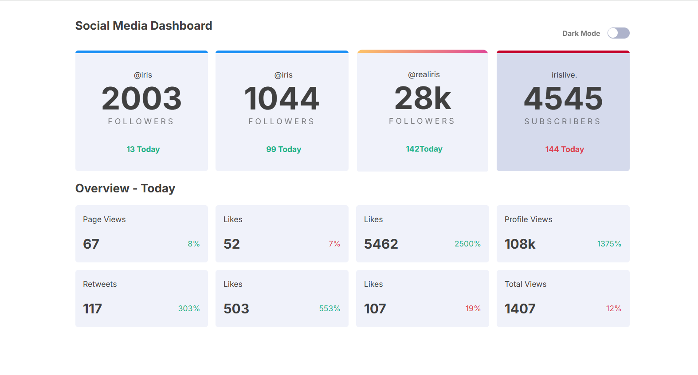
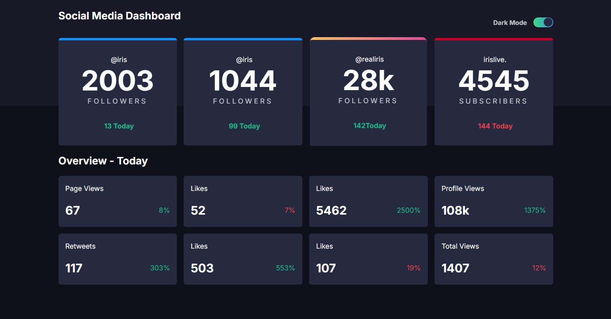

## Social Media Dashboard

  A dynamic and responsive Social Media Dashboard designed to help users monitor and analyze their social media accounts effectively. This project provides a user-friendly interface for tracking performance metrics, engagement, and insights across multiple social platforms.

## Features

    Responsive Design: Optimized for all screen sizes, from mobile to desktop.
    Dark Mode: Toggle between light and dark themes.
    Interactive Charts: Visualize data with dynamic charts and graphs.
    Account Overview: Track followers, likes, shares, and other key metrics.
    Cross-Platform Support: Manage multiple social accounts from one dashboard.

## Technologies Used

    Frontend: HTML, CSS, JavaScript, Tailwind CSS
    Charts: Chart.js or D3.js
    Backend: Node.js, Express.js
    Database: MongoDB or Firebase
    Authentication: OAuth2.0 for secure login (Google, Facebook, etc.)
    API Integration: Twitter API, Facebook Graph API, Instagram Basic Display API

## Screenshots

Dashboard Overview:

Dark Mode Enabled:

## Future Enhancements

Add support for additional social media platforms like LinkedIn, TikTok, etc.
Implement advanced analytics features such as sentiment analysis and trend prediction.
Introduce push notifications for significant updates.
Add customization options for widgets and layout.

Contributing

Contributions are welcome! 

## Contact

Email:  chagankekra13@gmail.com
GitHub: @ikekra

